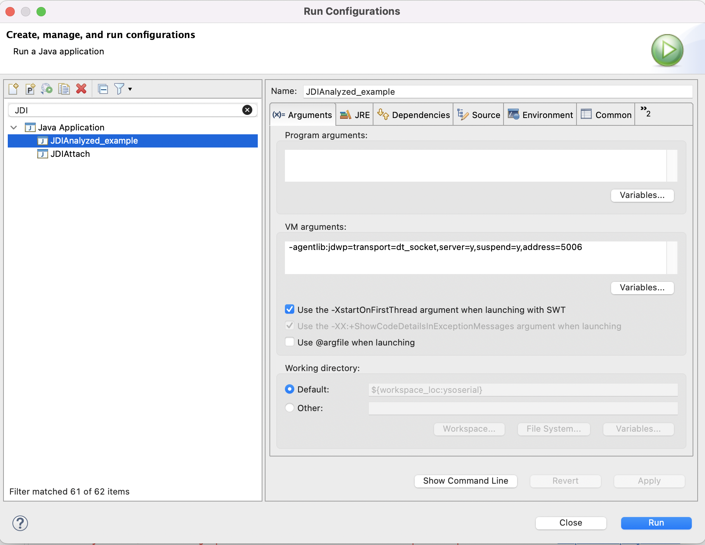

# JavaCallStackExtractor  :

This project offers the possibility to extract the maximum information available from a Java callstack in a text file.

##  How to use

At the time being you need to use a version of java between java 9 and 21 (a newer version might work but no testing has been done).
Try synchronizing the java version used on the program to analyze and this program 
(Having different versions might work, but unsynchronized versions could maybe create unexpected behaviors)

#### 1) Launch the program you want to analyze with this argument on the VM :  
-agentlib:jdwp=transport=dt_socket,server=y,suspend=y,address=5006  

As a reference here is how you add it in a run configuration on eclipse :  
	  

This command enables debug mode on the Java VM:  
- jdwp: Java Debug Wire Protocol
- transport=dt_socket: Indicates that communication is over a network (which allows for operating system independence)
- server=y: Indicates that the JVM is acting as a debug server, y means yes: the JVM is waiting for a debugger to connect
- suspend=y: Indicates that the JVM is waiting for a debugger to connect before starting execution
- address=5006: Indicates the port on which the JVM will wait for a connection

#### 2) Modify the variables in the main program in JDIAttach to adapt it for your usage

Here is a quick explanation of what these variables mean :  
For attaching this program to yours :  
- name : of the host (if done locally it will stay at "localhost")
- port : address of the VM (if using the given argument in the part 1, will stay on "5006")

For adding a breakpoint indicating the last line of your call stack :  
- className :  the name of the class where the method is situated
- methodName : the name of the method
- methodArguments : name of all arguments type of the method in the declaration order

For the start of the call stack :
- threadName : the name of the method at the start of the call stack (generally it will be the main)

#### 3) Launch the main of JDIAttach and collect the output in a file

## Future additions

This program could possibly work with java versions between 1.3 and 8, by changing packages imports (including com.sun.jdi dependencies).  
No test of package modifications has been done yet so it's still only an hypothetical possibility to make it works this way in these versions.