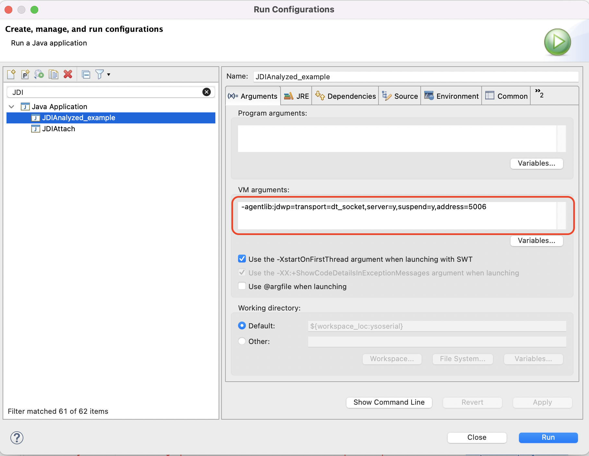

# JavaCallStackExtractor  :

This project offers the possibility to extract the maximum information available from a Java callstack in a text-based file.

##  How to use

At the time being you need to use a version of java between java 9 and 21 (a newer version might work but no testing has been done).
Try synchronizing the java version used on the program to analyze and this program 
(Having different versions might work, but unsynchronized versions could maybe create unexpected behaviors)

#### 1) Launch the program you want to analyze with this argument on the VM :  
-agentlib:jdwp=transport=dt_socket,server=y,suspend=y,address=5006  

As a reference here is how you add it in a run configuration on eclipse :  
	  

This command enables debug mode on the Java VM:  
- jdwp: Java Debug Wire Protocol
- transport=dt_socket: Indicates that communication is over a network (which allows for operating system independence)
- server=y: Indicates that the JVM is acting as a debug server, y means yes: the JVM is waiting for a debugger to connect
- suspend=y: Indicates that the JVM is waiting for a debugger to connect before starting execution
- address=5006: Indicates the port on which the JVM will wait for a connection

#### 2) Modify the config.json to make the JDICallstackExtractor works on your project
Check [config.md](utils/tutorials/config.md) for more details

#### 3) Launch the main of JDICallstackExtractor, and the output will appear in the root of this git project